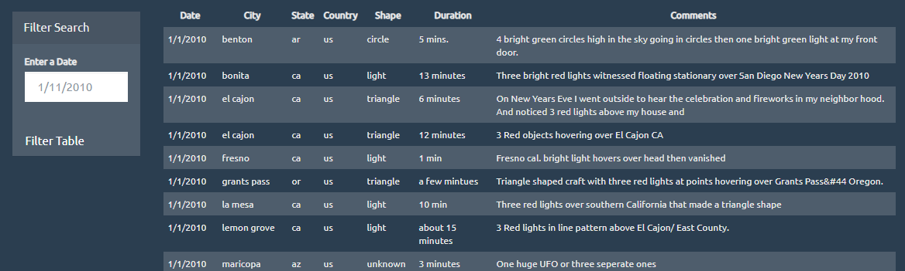

# The Truth is Out There

## Background
WAKE UP SHEEPLE! The extra-terrestrial menace has come to Earth and we here at ALIENS-R-REAL have collected all of the eye-witness reports we could to prove it! 

Use the repo to search through the reports by date. Dates are available from 1/1/2010 to 1/13/2010.

## Features
The repo contains two solutions - 

* [Solution Level 1](UFO-level-1/) - Allows the user to input a date that JavaScript code will listen for and filter the data to find rows that match the requested date.

* [Solution Level 2](UFO-level-2/) - Allows the user to select from a list of cities, states, countries, and shapes in addition to entering a date. The JavaScript code will then listen for changes and filter the data to find rows that match the requested entries.

Both solutions populate a table with data that displays the columns `Date`, `City`, `State`, `Country`, `Shape`, `Duration` and `Comments`.

If no data is returned, both solutions will display an alert:

There is also a button to reset the page and clear all search criteria.

## Status
_finished_

## Inspiration
This project was assigned as part of the UTSA Data Analytics Bootcamp.